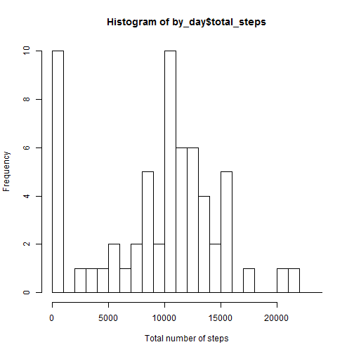
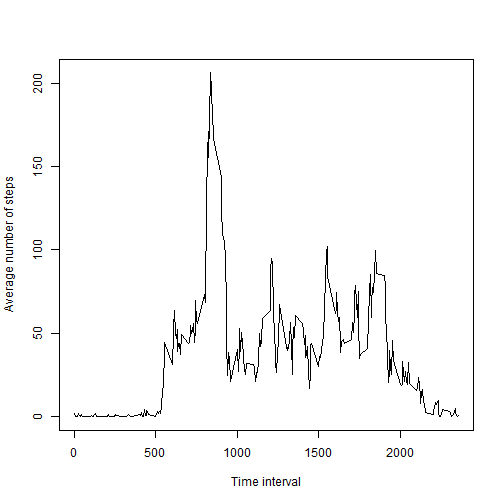
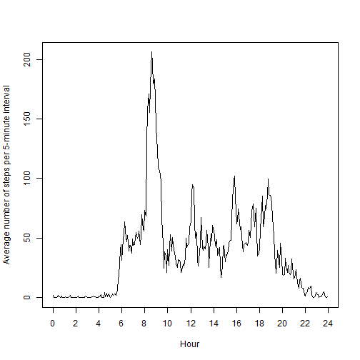
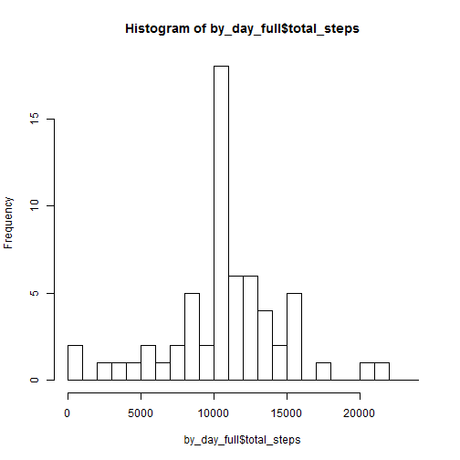
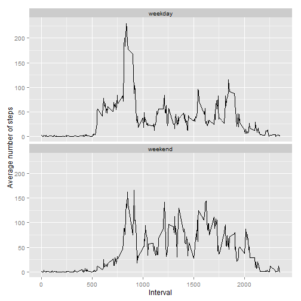
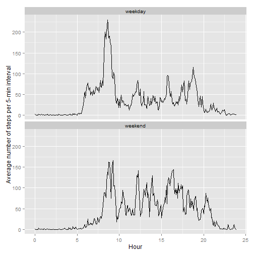

Reproducible Research: Peer Assessment 1
========================================

## Loading and preprocessing the data

This assignment makes use of data from a personal activity monitoring
device. This device collects data at 5 minute intervals through out the
day. The data consists of two months of data from an anonymous
individual collected during the months of October and November, 2012
and include the number of steps taken in 5 minute intervals each day.

* Dataset: [Activity monitoring data](activity.zip) [52K]

The variables included in this dataset are:

* **steps**: Number of steps taking in a 5-minute interval (missing
    values are coded as `NA`)

* **date**: The date on which the measurement was taken in YYYY-MM-DD
    format

* **interval**: Identifier for the 5-minute interval in which
    measurement was taken

We read **dataset** from zipped csv file and create additional variable

* **time**: Time of beginning of the 5-minute interval.


```r
dataset <- read.csv(unz("activity.zip", "activity.csv"), stringsAsFactors=FALSE)
dataset$time <- as.POSIXct(strptime(paste(dataset$date,
                                          dataset$interval %/% 100,
                                          dataset$interval %% 100),
                                    "%Y-%m-%d %H %M"))
dataset$date <- as.Date(dataset$date, "%Y-%m-%d")
```

We are using the fact that `interval` variable is just an integer converted
from string with `%H%M` format.

## What is mean total number of steps taken per day?

We will use dplyr package to manipulate data.


```r
library(dplyr, warn.conflicts = FALSE, quietly = TRUE)
```

First, convert dataset into datatable **dt** and produce new datatable by
grouping by date and summarizing by steps.

**by_day** contains 2 variables:

* **date**: The date on which the measurement was taken

* **total_steps**: Total number of steps for this day


```r
dt <- tbl_df(dataset)
by_day <- 
    dt %>%
    group_by(date) %>%
    summarize(total_steps = sum(steps, na.rm=TRUE))
```


```r
max(by_day$total_steps)
```

Maximum amount of steps by day is 21194, so we can create
a histogram with 24 bins.


```r
xbreaks <- seq(0, 24000, by = 1000)
hist(by_day$total_steps, breaks = xbreaks,
     xlab = "Total number of steps")
```

 

Compute mean total number of steps taken per day.


```r
mean(by_day$total_steps)
```

```
## [1] 9354.23
```

Compute median total number of steps taken per day.


```r
median(by_day$total_steps)
```

```
## [1] 10395
```

## What is the average daily activity pattern?

Create new datatable by grouping by interval and summarizing by steps.

**by_time** contains 3 variables:

* **interval**: Identifier for the 5-minute interval in which
    measurement was taken

* **avg_steps**: Average number of steps for this interval

* **hour**: Time when the 5-minute interval starts, in hours


```r
by_time <-
    dt %>%
    group_by(interval) %>%
    summarize(avg_steps = mean(steps, na.rm=TRUE)) %>%
    mutate(hour = (interval %/% 100) + (interval %% 100) / 60)
```

First, we construct required plot of average number of steps
over the 5-minute interval.


```r
plot(by_time$interval, by_time$avg_steps, type="l", xlab="Time interval",
     ylab="Average number of steps")
```

 

Unfortunately, there are large gaps between the last interval of hour
and the first interval of next hour. So we create a plot with hours
instead of interval identifiers at x axis. This plot does not have gaps.


```r
plot(by_time$hour, by_time$avg_steps, type="l", xaxt="n", xlab="Hour",
     ylab="Average number of steps per 5-minute interval")
axis(1, at=seq(0, 24, by = 2))
```

 

Now we determine which 5-minute interval, on average across all the days
in the dataset, contains the maximum number of steps.


```r
by_time %>%
    filter(avg_steps == max(avg_steps)) %>%
    print
```

```
## Source: local data frame [1 x 3]
## 
##   interval avg_steps     hour
## 1      835  206.1698 8.583333
```

## Imputing missing values

The total number of missing values in the dataset.


```r
sum(is.na(dt$steps))
```

```
## [1] 2304
```

So there are 2304 missing values, we have to fill them in.
The simplest reasonable strategy is to use the mean
for corresponding 5-minute interval over all days, since the number of steps
depends on time much more than on date.

We create a new dataset **dt_full** that is equal to the original dataset
but with the missing data filled in.


```r
dt_full <- dt
for(i in 1:length(dt$steps)) {
    if (is.na(dt$steps[i])) {
        interval_num <- (dt$interval[i] %/% 100) * 12 +
            (dt$interval[i] %% 100) / 5 + 1
        dt_full$steps[i] <- round(by_time$avg_steps[interval_num])
    }    
}
```

Produce new datatable by grouping by date and summarizing by steps.

**by_day_full** contains 2 variables:

* **date**: The date on which the measurement was taken

* **total_steps**: Total number of steps for this day

Make a histogram of the total number of steps taken each day and Calculate and report the **mean** and **median** total number of steps taken per day.


```r
by_day_full <- 
    dt_full %>%
    group_by(date) %>%
    summarize(total_steps = sum(steps))
```

Now we make a histogram of the total number of steps.


```r
hist(by_day_full$total_steps, xbreaks)
```

 

Compute mean and median.


```r
mean(by_day_full$total_steps)
```

```
## [1] 10765.64
```


```r
median(by_day_full$total_steps)
```

```
## [1] 10762
```

They are greater than the values for dataset without imputing missing values.

## Are there differences in activity patterns between weekdays and weekends?

Create a new factor variable **week_day** with two levels -- "weekday"
and "weekend" indicating whether a given date is a weekday or weekend day.

We use `wday` function from lubridate library for that.


```r
library(lubridate)
dt_full$week_day <-
    factor(ifelse(wday(dt_full$date) %in% c(1, 7), "weekend", "weekday"))
```

Create new datatable `by_weekdays` by grouping `dt_full` by time interval
and week_day factor, then averaging by steps.

**by_weekdays** contains 3 variables:

* **interval**: Identifier for the 5-minute interval in which
    measurement was taken

* **week_day**: Type of day, weekday or weekend

* **avg_steps**: Average number of steps for this interval and type of day


```r
by_weekdays <-
    dt_full %>%
    group_by(interval, week_day) %>%
    summarize(avg_steps = mean(steps))
```

Make a panel plot containing a time series plot
of the 5-minute interval (x-axis) and the average number of steps taken,
averaged across all weekday days or weekend days (y-axis).


```r
library(ggplot2)
ggplot(by_weekdays, aes(interval, avg_steps)) +
    facet_wrap(~ week_day, nrow=2) + geom_line() +
    xlab("Interval") + ylab("Average number of steps")
```

 

The same plot without gaps, like before.


```r
ggplot(by_weekdays, aes((interval %/% 100) + (interval %% 100) / 60,
                        avg_steps)) + 
    facet_wrap(~ week_day, nrow=2) + geom_line() +
    xlab("Hour") + ylab("Average number of steps per 5-min interval")
```

 
